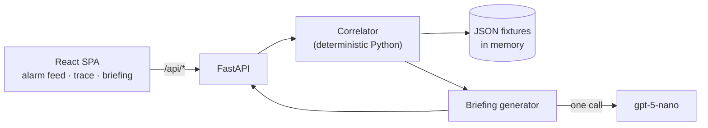

# Incident Intelligence Platform

**An AI incident-triage console for data center operations.** An alarm fires; the system pulls the
equipment record, the surrounding telemetry, similar past incidents and the relevant SOPs, and hands
the on-call field team a single briefing: probable causes ranked by confidence, a numbered action
plan, the tools and parts to bring, and the document sections that justify each step.

🔗 **[Live demo](https://incident-intelligence-platform.vercel.app)** · no login, no API key needed

> Built as a prototype to explore how an autonomous agent would reason about datacenter faults.
> All data is synthetic — see [Dataset](#dataset) and [Implementation notes](#implementation-notes--limitations).

<!-- TODO: add docs/screenshot.png — the scenario C trace mid-run is the shot that sells this -->

---

## The problem

An alarm on its own tells an operator almost nothing. `CRAC-B-07 discharge temp 38.1°C` is a number,
not a diagnosis. Deciding what to actually do means assembling context that lives in four different
places:

- **live telemetry** in the BMS — is this spiking or drifting, and what else moved with it?
- **equipment records** — what model, what refrigerant, when was it last serviced?
- **incident history** — has this exact thing happened before, and what fixed it?
- **procedures** — which SOP governs this, and what does step 3 actually say?

That assembly is a retrieval task performed by a human, under time pressure, at 3am. This project
does the retrieval mechanically and uses an LLM only for the last mile: turning the assembled
context into a briefing someone can act on.

---

## The three scenarios

The demo ships three scenarios, each built to exercise a different shape of reasoning. They're
listed in the left rail; **scenario C is the interesting one.**

### A — Single alarm, competing hypotheses
`CRAC-B-07`, Zone B, discharge temp 38.1°C against a 32°C threshold.

Two causes fit the primary symptom: a clogged filter or low refrigerant. They're distinguished by a
second signal — **zone humidity rising alongside temperature**. Restricted airflow across the
evaporator drives humidity up; a refrigerant leak doesn't. The historical record contains one
incident of each kind, so retrieval alone can't settle it; the discriminator has to come from the
telemetry.

### B — Correlated pair, and a false-positive trap
`PDU-A-03` voltage fluctuation, plus a lower-severity UPS battery-temperature alarm in the same zone.

Three candidate causes: degrading capacitors, upstream supply variance, or sensor drift. The case
base is deliberately seeded with both a genuine capacitor fault **and** a prior incident that turned
out to be a miscalibrated sensor — so the system has to justify why this one isn't the false alarm.
A vendor bulletin narrows it further: the unit's build year falls inside an affected batch range.

### C — Multi-zone cascade with a shared upstream cause
Four alarms across Zones C and D — two rack over-temps, a humidity alarm, and a **critical** CRAC
compressor fault.

Triaged individually, these look like four unrelated problems. They aren't: the affected equipment
all sits on **chiller Loop 2**, and the real fault is upstream in the chiller plant. This is the
scenario that separates per-alarm triage from reasoning about topology — and the briefing's most
important output is a negative instruction: *do not restart the individual CRAC units.*

---

## Architecture



There is **no database**. All six fixture files are read once at import into `app.state.data`
([`services/data_loader.py`](backend/services/data_loader.py)), which also makes cold starts on
serverless deployment cheap. The API is entirely read-only.

The pipeline for one briefing is: `correlate(alarm_id)` assembles a context bundle → `_build_prompt`
flattens it into a text dossier → one LLM round-trip returns JSON matching a fixed schema.

---

## How the correlation engine works

This is the part that's real logic rather than a model call, and it lives in
[`backend/services/correlator.py`](backend/services/correlator.py).

**1. Scope the telemetry.** Select every sensor stream tagged to the alarm's scenario, and flag a
stream as anomalous when its most recent reading breaches its threshold.

**2. Retrieve similar incidents by weighted score.** Each historical incident is scored against the
active alarm set:

| Signal | Points |
|---|---|
| Shares equipment with an active alarm | **3** |
| Shares a zone | **2** |
| Shares an alarm type | **1** |

Incidents scoring **≥ 2** qualify, sorted descending, **top 3** kept. The threshold is the design
decision worth noting: an alarm-type match alone scores 1 and is therefore *not* enough to retrieve
an incident — "some other CRAC once ran hot" isn't evidence. Equipment or zone overlap is required.
Zone matching uses substring containment, so an incident recorded against `"Zone C, Zone D"` is
correctly retrieved for either zone.

**3. Retrieve documents by tag.** A document is relevant if its `equipment_tags` contain the
equipment *type* (`CRAC`) or the specific unit (`CRAC-B-07`), or its `alarm_type_tags` intersect the
active alarm types. Capped at 6.

**4. Scenario-C overrides.** For the cascade, the chiller loop schematic and the P1 cascading-failure
SOP are force-inserted at the top of the document list — the upstream topology is the thing the model
most needs and tag matching alone wouldn't rank it first.

The assembled bundle then becomes a plain-text dossier — alarms, equipment specs, anomalous sensors
with their last five readings, matched incidents with their root cause and resolution, and document
excerpts truncated to 400 characters per section. The system prompt in
[`briefing_generator.py`](backend/services/briefing_generator.py) is essentially a JSON schema
contract, and the response is parsed with a fenced-code-block fallback.

---

## Running it locally

Two terminals. **You do not need an API key** — see the note below.

```bash
# terminal 1 — backend on :8000
python3.11 -m venv .venv
.venv/bin/pip install -r backend/requirements.txt
cd backend && ../.venv/bin/uvicorn main:app --reload --port 8000
```

```bash
# terminal 2 — frontend on :5173
cd frontend && npm install && npm run dev
```

Open **http://localhost:5173**. Interactive API docs are at **http://localhost:8000/docs**.

**On the API key.** The full demo runs with no credentials: `GET /api/briefing/{scenario}` serves
pre-generated briefings from `data/briefings.json`, which is what the UI loads by default. Only the
**Regenerate Briefing** button calls the model live (`POST /api/briefing/generate`), and it returns
`503` with a clear message if `OPENAI_API_KEY` is unset. To enable it, copy
[`backend/.env.example`](backend/.env.example) to `backend/.env` and fill in your key.

**How the frontend finds the backend.** In development `VITE_API_URL` is unset, so requests go to
relative `/api/...` and Vite proxies them to `localhost:8000`
([`vite.config.js`](frontend/vite.config.js)). In production `.env.production` points at the deployed
backend. If you deploy this yourself, set `ALLOWED_ORIGINS` on the backend to your frontend's origin —
it defaults to localhost only, and the browser will block cross-origin requests otherwise.

---

## API reference

All routes are mounted under `/api`.

| Method | Endpoint | Returns |
|---|---|---|
| `GET` | `/api/alarms` | Alarms grouped by scenario, each group sorted by severity, groups sorted worst-first |
| `GET` | `/api/alarms/{alarm_id}` | `{alarm, sensors[], equipment}` for the alarm's scenario · `404` if unknown |
| `GET` | `/api/briefing/{scenario_id}` | Cached briefing for scenario `A`/`B`/`C` (case-insensitive) · `404` if none |
| `POST` | `/api/briefing/generate` | Live LLM briefing for `{"alarm_id": "..."}` · `503` without a key, `404` if unknown |
| `GET` | `/api/documents` | Document index, `sections` omitted to keep the payload small |
| `GET` | `/api/documents/{doc_id}` | Full document including all sections · `404` if unknown |
| `GET` | `/api/incidents` | All historical incidents |
| `GET` | `/api/cost-model` | Cost projection using default assumptions |
| `POST` | `/api/cost-model/calculate` | Cost projection for custom volume and token assumptions |

---

## Dataset

Everything in [`backend/data/`](backend/data/) is **synthetic** — written to exercise the three
scenarios above. It is not operational data from any real facility, and the equipment identifiers,
serial numbers, incident records and SOP text are all invented. Vendor model names appear because
realistic hardware naming makes the scenarios legible; nothing here reflects any real deployment.

| File | Contents |
|---|---|
| `equipment.json` | 12 assets — 4 CRAC, 3 racks, 2 PDU, 2 chillers, 1 UPS, across Zones A–D and a central plant. Carries the **chiller-loop topology** scenario C depends on |
| `sensors.json` | 12 streams × 25 readings = 300 points, 5-minute resolution over 2 hours (temperature, humidity, voltage) |
| `alarms.json` | 7 alarms — 1 in scenario A, 2 in B, 4 in C |
| `incidents.json` | 8 historical incidents, each with root cause, resolution, parts, tools and time-to-resolve |
| `documents.json` | 11 documents / 29 sections — 6 SOPs, 2 manuals, 1 vendor bulletin, 1 schematic, 1 procedure |
| `briefings.json` | 3 cached briefings, one per scenario, so the demo runs without credentials |

---

## Cost model

Briefing cost is the reason a small model was chosen. At gpt-5-nano's $0.05 / $0.40 per million
input/output tokens, the three cached briefings cost **$0.00043–$0.00059 each** — roughly $0.0005 to
turn an alarm into an actionable field briefing. At 200 alarms/day that's a few dollars a month.

The `/cost-model` page lets you vary alarm volume and token assumptions (a realistic case and a
pessimistic one) and see monthly spend. Note that the two comparison rows are labelled
**illustrative price tiers**, not quotes for any specific vendor's model — published prices move, and
the point of the table is the order-of-magnitude gap, not a procurement estimate.

---

## Implementation notes & limitations

Worth being explicit about, since this is a prototype:

- **The reasoning trace in the UI is a scripted visualization, not instrumentation.** The tool calls,
  RAG similarity scores and token-by-token "thinking" you see streaming in the console are generated
  client-side in [`frontend/src/utils/traceBuilder.js`](frontend/src/utils/traceBuilder.js) from the
  real fetched data. The backend does **one** LLM round-trip after a deterministic Python correlation
  pass — there is no agentic loop, no tool-calling, no embeddings and no vector store. The trace
  illustrates how such a pipeline *would* execute; it does not report how this one did. The
  correlation logic it depicts is real and lives in `correlator.py`.
- **Anomaly detection is one-sided.** A sensor is flagged only when `last_reading > threshold`, so an
  under-threshold fault — a voltage *sag*, which is what scenario B is nominally about — wouldn't trip
  it. Correct handling needs per-sensor direction or a band.
- **Multi-alarm correlation is hardcoded to scenario C** rather than derived from equipment topology.
  A general version would cluster active alarms by shared upstream dependency.
- **The Pydantic domain models are decorative.** `Sensor`, `Alarm`, `Equipment`, `Incident` and
  `Document` are defined in `models/schemas.py` but no route declares a `response_model`, so routes
  return raw dicts and nothing is validated on the way out.
- **Desktop only**, dark theme only — no responsive breakpoints.

---

## Tech stack

**Backend** — FastAPI, Pydantic, OpenAI Python SDK (Responses API), deployed as a single Vercel
Python function.
**Frontend** — React 19, Vite, React Router, Tailwind CSS v4, Recharts (sensor sparklines),
lucide-react. The agent topology diagram is hand-rolled SVG.

## License

[MIT](LICENSE)
